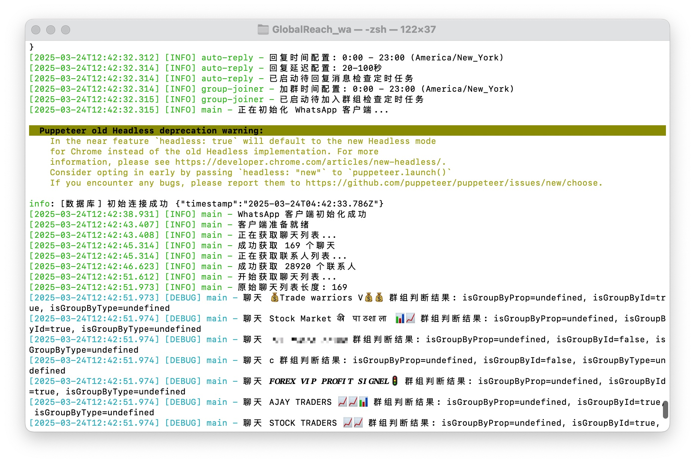

# WhatsApp 自动化系统

该系统是一个基于 whatsapp-web.js 的 WhatsApp 自动化工具，实现了多项功能，包括自动加群、自动回复、群组成员采集和联系人问候等。

## 主要功能

### 1. WhatsApp 监控主程序 (whatsapp-monitor.js)

主程序负责初始化和协调所有功能模块，主要特点：

- 使用 Puppeteer 无头浏览器模式登录 WhatsApp Web
- 提供二维码扫描登录功能
- 集成多个功能模块并进行初始化
- 包含自动重连和错误处理机制
- 支持优雅退出，确保所有资源正确释放

### 2. 自动回复系统 (auto-reply.js)

提供智能自动回复功能，主要特点：

- 基于 AI 的自然语言回复，支持上下文理解
- 内置角色设定为美国波士顿的机械工程师，投资 Tesla 和 NVIDIA 股票
- 根据纽约时间 (9:00 AM - 1:00 AM) 控制回复时间
- 对非回复时间收到的消息进行排队，等待下一个可回复时间窗口
- 自动保存对话记录到数据库
- 支持针对特定消息类型的自定义回复

### 3. 自动加群系统 (group-joiner.js)

自动加入 WhatsApp 群组功能，主要特点：

- 自动从数据库获取待加入的群组链接
- 根据纽约时间 (9:00 AM - 1:00 AM) 控制加群时间
- 每24小时自动执行一次加群任务
- 支持加群间隔随机延时，避免被系统限制
- 记录加群结果并更新数据库状态
- 自动检测无效链接和已加入群组

### 4. 群组成员采集系统 (group-member-collector.js)

自动采集群组成员信息功能，主要特点：

- 定期扫描所有已加入的群组
- 采集群组成员的ID、名称、手机号码等信息
- 标记群组管理员
- 将成员信息保存到数据库
- 自动将新成员添加到联系人表中
- 支持分批处理以避免资源占用过多

### 5. 联系人问候系统 (contact-greeter.js)

自动向联系人发送问候消息功能，主要特点：

- 从数据库中获取未发送问候的联系人
- 使用 AI 生成个性化问候语
- 根据纽约时间 (9:00 AM - 1:00 AM) 控制发送时间
- 随机延时发送，避免被系统限制
- 记录发送结果并更新联系人状态
- 支持自定义预设问候语

## 数据库结构

系统使用 MySQL 数据库存储数据，主要表结构：

1. `wa_auto_replies` - 存储自动回复记录
2. `whatsapp_walinkextraction` - 存储待加入的群组链接
3. `whatsapp_group_joins` - 存储群组加入记录
4. `wa_groups` - 存储群组信息
5. `wa_group_members` - 存储群组成员信息
6. `wa_contactsdetails` - 存储联系人信息和状态

## 配置说明

系统通过 .env 文件进行配置，主要配置项：

- 数据库连接信息
- AI 接口配置
- 时间窗口设置
  - `REPLY_TIME_START`: 开始回复时间（小时，24小时制）
  - `REPLY_TIME_END`: 结束回复时间（小时，24小时制）
  - `REPLY_TIMEZONE`: 时区设置
  - `REPLY_DELAY_MIN`: 最小回复延迟（秒）
  - `REPLY_DELAY_MAX`: 最大回复延迟（秒）
- 自动加群限制
- 日志路径

## 使用方法

1. 安装依赖：`npm install`
2. 配置 .env 文件
3. 运行系统：`node whatsapp-monitor.js`
4. 扫描显示的二维码登录 WhatsApp
5. 系统将自动启动所有功能模块

## 注意事项

- 请遵守 WhatsApp 使用条款，避免过度自动化导致账号被封
- 建议使用专用号码进行操作，避免影响个人日常使用
- 定期备份数据库，避免数据丢失
- 合理设置时间窗口和延时参数，避免触发 WhatsApp 的反垃圾机制

## 后端

## 技术栈

### 前端

- Vue.js
- Element UI

### 后端

- Spring Boot
- Spring Security
- Redis
- JWT (JSON Web Tokens)

## 核心功能

- **多终端认证系统**：支持多种设备登录，确保用户在不同终端上的无缝体验。
- **动态权限菜单**：根据用户角色动态加载菜单，实现灵活的权限控制。
- **代码生成器**：一键生成前后端代码，大幅提升开发效率。

## 联系

<a href="https://t.me/cocoboot" target="_blank">@cocoboot</a>
